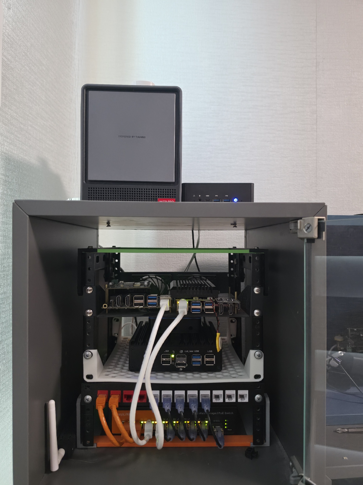
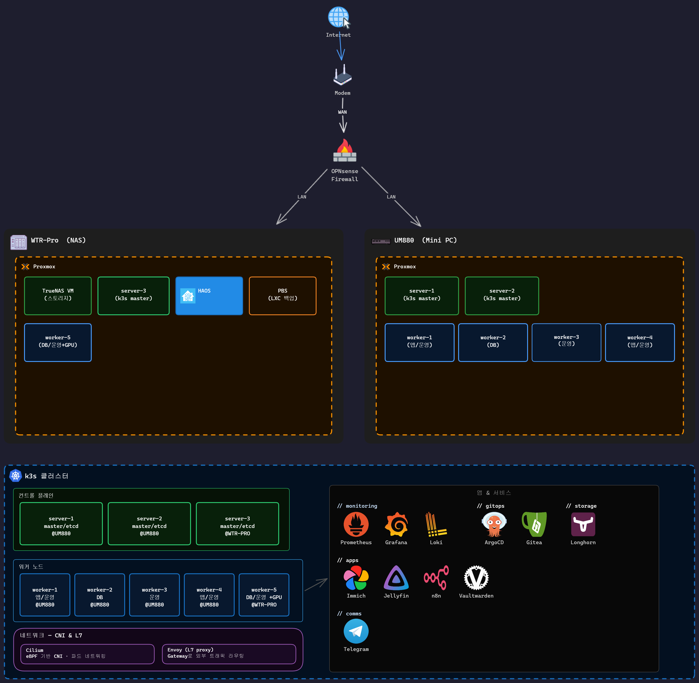
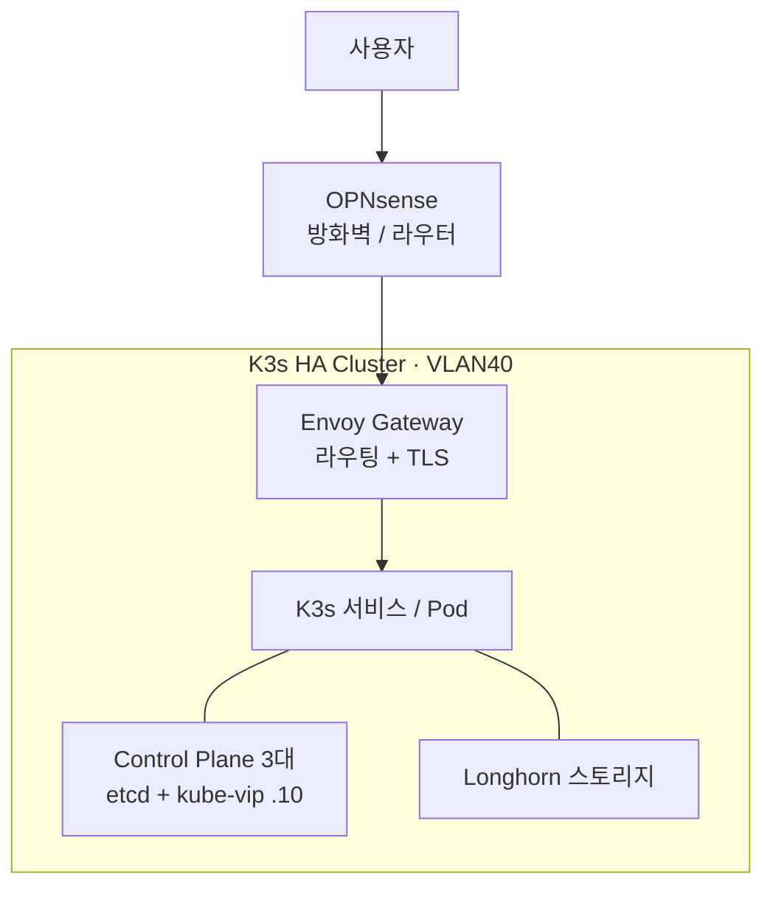

# Homelab Infrastructure

물리 서버 2대에 Proxmox 가상화, ZFS 스토리지, VLAN·본딩 네트워크 같은 인프라 기반 계층을 직접 구성·운영하고, 그 위에 K3s 클러스터를 올려 Terraform(프로비저닝)·Ansible(구성)·ArgoCD(GitOps)로 운영하는 온프레미스 인프라 프로젝트입니다.



> 직접 구성한 홈랩 랙. WTR-Pro(Proxmox 호스트), 2.5G PoE 스위치, 패치패널 등으로 구성.

> [!NOTE]
> 개인 학습·운영용 홈랩입니다. 구성 과정에서 공식 문서와 AI 도구의 도움을 활용했고, 생성된 설정은 직접 검증·수정해 적용했습니다.
> 이 저장소는 실제 운영 중인 홈랩에서 인프라 코어와 immich 등 일부 서비스만 발췌해 공개한 것으로, 전체 구성의 일부입니다.

> [!IMPORTANT]
> **2026-06-02 스냅샷입니다.** 그 뒤 호스트 RAM이 모자라 클러스터를 컨트롤플레인 1대 + 워커 4대(5노드, HA 아님)로 줄였습니다. 아래 8노드 HA 구성은 당시 기준이고, 줄인 경위는 블로그 [K3s 노드 축소](https://blog.jw-oh.xyz/HomeLab/K3s-노드-축소)에 있습니다.

## 구성 개요

### 인프라 기반 계층
- **물리 호스트**: 미니 PC 2대(UM880, WTR-Pro)에 Proxmox VE
- **네트워크**: OPNsense 라우팅·방화벽, VLAN으로 관리망/서비스망 분리, 2.5GbE 2개를 802.3ad(LACP)로 본딩, 전 구간 MTU 정합
- **스토리지**: TrueNAS(ZFS RAID-Z2) + NFS — 영구 데이터 원본
- **모니터링**: Prometheus·Grafana·Loki·Tempo(메트릭·대시보드·로그·트레이싱), 임계치 알림 / 외부 OPNsense 메트릭은 Telegraf로 수집
- **백업**: PBS로 VM 전체, Longhorn으로 볼륨 데이터, etcd 스냅샷까지 계층별 백업
- **자동화**: Terraform(VM 프로비저닝) + Ansible(OS·노드 구성) IaC

### 그 위의 컨테이너 오케스트레이션 계층
- **클러스터**(스냅샷 당시): K3s HA — Server 3대(embedded etcd) + Worker 5대, 총 8노드, kube-vip API VIP → 현재 5노드, HA 아님
- **CNI**: Cilium — Pod 네트워크 + LoadBalancer IP를 OPNsense에 BGP로 광고
- **스토리지/인그레스/배포**: Longhorn 분산 블록 스토리지, Envoy Gateway(Gateway API), ArgoCD GitOps

## 구조



> 전체 토폴로지 — Proxmox 2대(WTR-Pro/NAS, UM880)와 그 위에 올린 K3s 클러스터, 클러스터에서 동작하는 서비스 구성.

아래는 외부 요청이 서비스에 닿기까지의 경로를 단순화한 흐름입니다.



외부 트래픽은 OPNsense를 거쳐 Envoy Gateway로 들어오고, Gateway가 도메인별로 알맞은 서비스로 라우팅합니다. 클라우드 로드밸런서가 없는 홈랩 환경이라, Cilium이 OPNsense에 BGP로 LoadBalancer IP 경로를 광고해 외부에서 접근할 수 있게 합니다.

## 네트워크

| VLAN | 서브넷 | 용도 |
|------|--------|------|
| VLAN1 LAN | 192.168.1.0/24 | 관리, 내부 서비스 |
| VLAN40 SVC | 192.168.4.0/24 | K3s 클러스터 전용 |

- 전 구간을 MTU 1500으로 통일했습니다. VLAN 간 통신에서 구간별 MTU가 달라 큰 패킷이 silent drop되는 문제를 겪고, 전 경로를 일관되게 맞춰 해결했습니다.
- kube-vip 가상 IP `192.168.4.10` — API Server 고가용성 진입점
- Cilium LoadBalancer IP 풀 `192.168.4.80~90`

두 Proxmox 호스트는 2.5GbE 2개를 802.3ad로 묶었습니다. `iperf3` 측정 결과 단일 스트림 2.48Gbps, 4스트림 4.02Gbps로, 802.3ad가 세션 단위로 링크를 분산해 다중 연결에서 처리량이 늘어나는 것을 확인했습니다. 측정 명령과 전체 로그는 [네트워크 구조 문서](docs/network-architecture.md)에 정리했습니다.

## 주요 구성 요소

| 컴포넌트 | 용도 |
|----------|------|
| K3s | 경량 Kubernetes 클러스터 |
| kube-vip | API Server 고가용성용 가상 IP |
| Cilium | Pod 네트워크와 LoadBalancer IP 할당, BGP 광고 |
| Longhorn | 분산 블록 스토리지 |
| Envoy Gateway | Gateway API 기반 인그레스 |
| cert-manager | Let's Encrypt TLS 인증서 자동 발급 |
| Sealed Secrets | 시크릿을 암호화해 Git에 커밋 |
| ArgoCD | GitOps 지속적 배포 |
| Prometheus / Grafana / Loki / Tempo | 메트릭, 대시보드, 로그, 분산 트레이싱 |

## 트러블슈팅 기록

구축 과정에서 직접 겪고 해결한 주요 문제들입니다.

- **MTU 불일치**: 다른 VLAN의 노드가 클러스터 합류에 실패했습니다. ping은 되는데 K3s API 통신만 타임아웃이었고, 원인은 구간별 MTU가 달라(일부 1500 / 일부 9000) 큰 패킷이 silent drop된 것이었습니다. 전 구간을 1500으로 일관되게 통일해 해결했습니다.
- **kube-vip hostNetwork 누락**: kube-vip Pod가 Pod 네트워크에 갇혀 가상 IP가 호스트에 바인딩되지 않았습니다. DaemonSet에 `hostNetwork: true`를 추가해 해결했습니다.
- **Longhorn 기동 실패**: 노드에 `open-iscsi`가 없어 볼륨 연결에 실패했습니다. Longhorn이 iSCSI를 쓰기 때문인데, 모든 노드에 설치해 해결했습니다.

## 디렉터리 구조

```
terraform/   # Proxmox VM 프로비저닝
ansible/     # OS 설정, K3s 설치, 애드온 구성
k8s/         # ArgoCD가 관리하는 쿠버네티스 매니페스트
e25/         # 클러스터 외부 노드 (AdGuard, Uptime Kuma)
docs/        # 상세 문서
```

## 참고 문서

- [가상화 및 VM 프로비저닝](docs/virtualization.md)
- [네트워크 구조](docs/network-architecture.md)
- [스토리지 (TrueNAS / Longhorn)](docs/storage.md)
- [K3s HA 설치 가이드](docs/k3s-ha-setup.md)
- [백업 및 재해복구 전략](docs/backup-strategy.md)
