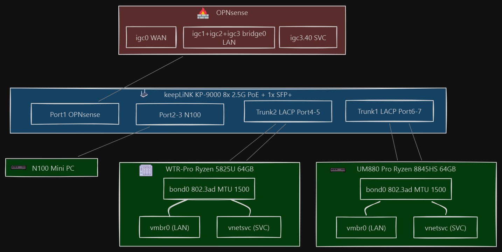
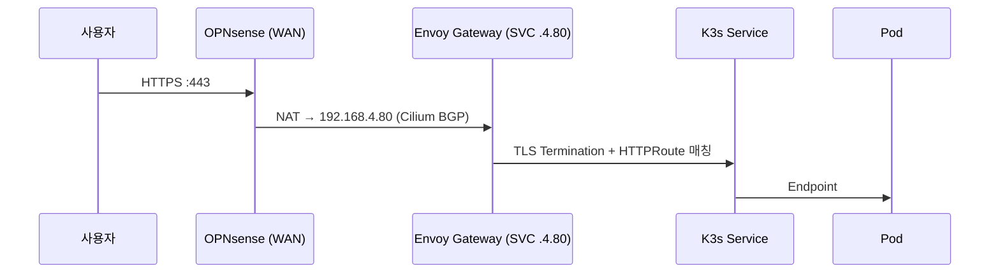

# 네트워크 구조

홈랩 네트워크의 VLAN 구성, 방화벽 정책, 물리 토폴로지를 정리합니다.

## 물리 토폴로지



## VLAN 설계

> **VLAN30 (PUB, 192.168.3.0/24)**: 현재 비활성. OPNsense `igc3.30` 인터페이스와 스위치 Tagged VLAN 설정은 유지됨. 향후 DMZ 용도로 재활용 가능.

| VLAN ID | 이름 | 서브넷 | Gateway | 용도 | 상태 |
|---------|------|--------|---------|------|------|
| 1 | LAN | 192.168.1.0/24 | 192.168.1.1 | 관리, 내부 서비스, AdGuard Home(E25), Home Assistant | 활성 |
| 30 | PUB | 192.168.3.0/24 | 192.168.3.1 | DMZ 예비 | 비활성 |
| 40 | SVC | 192.168.4.0/24 | 192.168.4.1 | K3s 클러스터 전용 | 활성 |

## 스위치 포트 설정 (keepLiNK)

| 포트 | 연결 대상 | Untagged | Tagged |
|------|-----------|----------|--------|
| Port 1 | OPNsense | VLAN1 | — |
| Port 2-3 | N100 (k3s 외 별도 용도) | VLAN40 (PVID) | — |
| Port 4-5 | WTR-Pro (Trunk2, LACP) | VLAN1 | VLAN30, VLAN40 |
| Port 6-7 | UM880 (Trunk1, LACP) | VLAN1 | VLAN30, VLAN40 |
| Port 8 | Uplink / OPNsense | VLAN1 | VLAN30, VLAN40 |

추가 설정: QoS Queue8 (Port 8, Trunk1, Trunk2), RSTP + IGMP Snooping, Jumbo Frame 12000, SFP+ 미사용

## MTU 설정 (중요)

전체 경로에서 MTU를 1500으로 일관되게 맞춰야 합니다. 핵심은 특정 값이 아니라 **경로 전 구간의 MTU 일치**입니다. 구간별로 MTU가 다르면(예: 일부 9000 / 일부 1500) 큰 패킷이 작은 MTU 구간에서 silent drop되어, ping 같은 작은 패킷은 되지만 큰 패킷 교환은 실패하는 진단하기 까다로운 장애가 발생합니다.

| 구간 | MTU | 설정 위치 |
|------|-----|-----------|
| keepLiNK Switch | 12000 (Jumbo 허용 상한) | Switch 관리 UI → Jumbo Frame |
| Proxmox bond0 / vmbr0 / vnetsvc | 1500 | `/etc/network/interfaces` |
| OPNsense LAN / SVC 인터페이스 | 1500 | Interfaces → [LAN]/[SVC] → MTU |
| VM eth0 (Cloud-Init) | 1500 | Terraform `network_device.mtu` |

> **주의**: 스위치의 Jumbo Frame 상한(12000)은 "허용 최대치"일 뿐이며, 1500 프레임도 그대로 통과시킵니다. 실제 엔드포인트(호스트 NIC·VM·OPNsense 인터페이스)의 MTU가 전 구간 동일해야 합니다. 한 구간이라도 어긋나면 크로스 VLAN 라우팅 시 K3s agent 조인 등 큰 패킷 교환이 실패할 수 있습니다(증상: ping은 되지만 K3s API 통신에서 `context deadline exceeded` 타임아웃).

## 외부 트래픽 흐름



## IP 할당 계획

### SVC VLAN40 (192.168.4.0/24)

| IP 범위 | 용도 |
|---------|------|
| 192.168.4.1 | Gateway (OPNsense) |
| 192.168.4.10 | kube-vip VIP (API Server) |
| 192.168.4.11-13 | K3s Server 노드 |
| 192.168.4.21-29 | K3s Worker 노드 |
| 192.168.4.80-90 | Cilium LB IPAM Pool |
| 192.168.4.100+ | 기타 서비스 (예약) |

### LAN VLAN1 (192.168.1.0/24)

| IP | 호스트 |
|----|--------|
| 192.168.1.1 | OPNsense (GW) |
| 192.168.1.114 | pve-wtrpro |
| 192.168.1.168 | keepLiNK Switch (mgmt) |
| 192.168.1.244 | um880 |

## 방화벽 정책 (OPNsense)

Proxmox 클러스터/SDN 방화벽은 비활성화. OPNsense가 모든 정책을 관리합니다.

### 도메인 매핑

| 도메인 | 대상 | 경로 |
|--------|------|------|
| *.local.example.com | K3s 내부 서비스 | LAN → .4.80 |
| hass.example.com | Home Assistant | LAN 직접 |

### 주요 방화벽 규칙

- **WAN → SVC**: NAT 포트포워딩 (443 → 192.168.4.80)
- **LAN → SVC**: 허용 (관리 접근, kubectl)
- **SVC → LAN**: 제한적 허용 (DNS, NFS, Gitea)
- **SVC → WAN**: 허용 (컨테이너 이미지 pull, apt 업데이트)
- **PUB 관련**: 비활성
- **Inter-VLAN**: 기본 차단, 명시적 허용만 통과

## 본딩(802.3ad)을 택한 이유

각 호스트의 2.5G NIC 2개를 LACP(802.3ad)로 묶었습니다.

- **처리량**: 여러 흐름이 동시에 오갈 때 두 링크로 분산되어, 단일 링크보다 전체 처리량이 늘어납니다.
- **Longhorn 복제 트래픽 대비**: 클러스터 노드 간 Longhorn 볼륨 복제가 돌면 노드 간 트래픽이 늘 수 있어, 대역폭에 여유를 두려고 했습니다.
- **링크 이중화**: NIC나 케이블 하나에 문제가 생겨도 나머지 링크로 통신이 유지됩니다.

## 성능 벤치마크

`um880` → `pve-wtrpro`(192.168.1.114) 간 `iperf3`로 측정했습니다.

**단일 스트림** — `iperf3 -c 192.168.1.114 -P 1`

```
[ ID] Interval           Transfer     Bitrate         Retr
[  5]   0.00-10.00  sec  2.88 GBytes  2.48 Gbits/sec    0    sender
[  5]   0.00-10.00  sec  2.88 GBytes  2.47 Gbits/sec         receiver
```

→ 2.5G 링크 한 개의 실질 대역폭(약 2.48 Gbps)을 다 쓰고, 재전송(Retr) 0으로 안정적.

**4 스트림** — `iperf3 -c 192.168.1.114 -P 4`

```
[SUM]   0.00-10.00  sec  4.68 GBytes  4.02 Gbits/sec  774    sender
[SUM]   0.00-10.00  sec  4.68 GBytes  4.02 Gbits/sec         receiver
```

→ SUM 4.02 Gbps. 여러 세션이 두 링크에 분산되어 단일 스트림(2.48G) 대비 약 1.6배로 증가. 다만 세션별로 한쪽 링크에 쏠리며 일부 재전송(Retr 774)이 발생했는데, 이는 802.3ad 해시 분배가 완벽히 균등하지 않은 데 따른 것입니다.

> 802.3ad는 흐름(세션) 단위로 링크를 나누므로 **단일 연결 속도를 2배로 만들지는 않습니다.** 단일 대용량 전송보다 여러 노드가 동시에 통신하는 클러스터 환경에 맞는 구성입니다.

### MTU 불일치 트러블슈팅 (참고)

MTU가 어긋나 있으면(일부 구간 9000 / 일부 1500) 큰 프레임이 작은 MTU 구간에서 silent drop되므로, ping은 되는데 K3s API처럼 큰 패킷을 주고받는 통신만 타임아웃이 납니다. 확인은 DF 비트를 켠 ping(`ping -M do -s 8972 <peer>`)으로 9000바이트가 통과하는지 보는 것이 가장 빠릅니다. iperf3로 보면 receiver 0 bytes와 재전송 반복 패턴이 나타날 수 있고, NIC 자체 문제는 `ethtool -S`의 에러 카운터로 배제할 수 있습니다. 이 환경은 전 구간을 1500으로 통일했습니다. 디스크 처리량이 병목이고 외부 통신과 작은 패킷 워크로드에는 점보 프레임의 이득이 없어서입니다.

## 관련 문서

- [K3s HA 설치 가이드](k3s-ha-setup.md)
